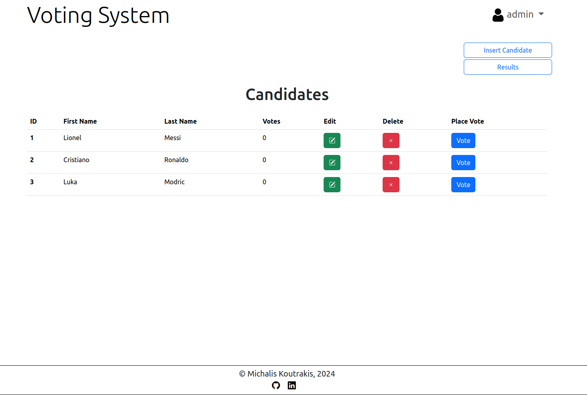

# Voting System
This Jakarta EE 10 application, built with JSP, streamlines candidate management and voting.
Admins can create, edit, or delete candidates, while users can cast a single vote.
Voting results can be viewed and exported in .csv format for easy analysis.

- **User registration**: Allows users to create an account with basic details like username, password, and profile information.
- **Login and Logout**: Users can securely log in and out of the system using their credentials.
- **Vote for a Candidate**: Authenticated users can view a list of candidates and select one to vote for.
- **Change Password**: Users can update their account password through the application.
- **View and Save Voting Results**: Users can view results and save them as csv files.

## Admin user
- A default user with the username admin is automatically created at startup if it doesn't already exist.
- **Only the admin user can add new candidates to the system.**
- The default password is **admin**, but it can be changed either in the
  `config.properties` file or through the "Change Password" option within the app.

## Tools and Technologies
- **Java 17**
- **MySQL 8.0.39**
- **Tomcat 10.1.25**
- **Jakarta EE 10**
- **Apache Commons DBCP**
- **BCrypt**
- **Docker**
- **Maven 3.9.8**

## Setup and Execution

### Prerequisites
- Ensure that **Java 17** is installed on your system.
- Set up the **MySQL** database following the instructions provided below.
- Install and run **Tomcat 10** web server on port 8080.

### Configuring the Application

The application uses a `src/main/resources/config.properties` to initialize the `admin` user and configure database access.

- **Admin User:** Modify the default admin password (`admin`) in the `config.properties` file.
  Alternatively, you can update it after logging in as an admin without changing the config file.

- **Database User:** The `config.properties` file also includes the credentials for the MySQL user created by the `mysql_database/create_database.sql` script.

  **IMPORTANT:** Before running the script or building the Docker image, it's strongly advised to replace the default `votingUser` password (`voting`) with a stronger one:

  ```sql
  CREATE USER 'votingUser' IDENTIFIED BY 'new_secure_password';
  GRANT ALL ON `votingDB`.* TO 'votingUser';

**and update the `config.properties` file accordingly.**

### Building the Project
If you have installed Java 17 or above in your system, and you have an MySQL server running you can build the project:
- If you **do not have Maven installed**, you can use the Maven Wrapper included in the project:
  - On Linux/macOS:
  ```bash
  ./mvnw clean package
  ```
  - On Windows:
  ```bash
  mvwn.cmd clean package 
  ```
- If you **already have Maven installed**, navigate to the project directory and run:
  ```bash
  mvn clean package
  ```

### Running the Application

After building the project, a `.war` file will be generated in the `target/` directory.
To run the application, copy the `.war` file to the `webapps/` folder in your Tomcat directory.

To access the voting app, open your browser and go to: http://localhost:8080/voting-system/

**Important**: Ensure the database is set up **before** running the application.

## Database Information

Inside the `mysql_database/` directory, you'll find two files:

1. **`create_database.sql`**: This script sets up a MySQL database called `votingDB` 
and creates a user named `votingUser` with the password `voting`.


2. **`Dockerfile`**: This file allows you to easily set up a MySQL server using
Docker and run the `create_database.sql` script.

### Create the Database

1. **Using MySQL Installed on Your System:**
    - If you have MySQL installed, you can simply run the `create_database.sql` script 
   directly to create the database.

2. **Using Docker:**
   1. Build the Docker image using the following command inside the `mysql_database` directory

      **IMPORTANT:** The default `MYSQL_ROOT_PASSWORD` in the `Dockerfile` is set to `password`.
      It is strongly recommended to replace this with a strong password before building the image.
      ```bash
      docker build -t mysql_voting_system_image .
      ```
   2. Create and run a container from the image to set up the database:
      ```bash
      docker run --name mysql_voting_container -d -p 3306:3306 mysql_voting_system_image
      ```

**Ensure the MySQL server is running before executing the application JAR file.**

## Application Preview

### Login Window


*The initial login window where users enter their credentials.*

### Sign Up Window


*The user registration window where new users sign up.*

### Voting Window


*The window where users cast their votes.*

### Candidates Editing Window (Admin Only)


*The interface used by admin to edit candidate details.*

### Results Window


*The window displaying the results of the voting.*

### Change Password Window


*The window where users can change their passwords.*

## Contact
**Michail E. Koutrakis**

**email:** koutrakismichalis [at] gmail [dot] com
